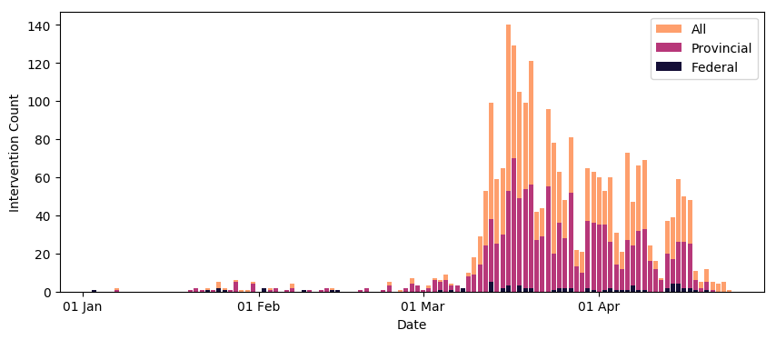

# Characterizing Canadian Federal, Provincial, Territorial, and Municipal Non-Pharmaceutical Interventions in Response to COVID-19: A Descriptive Analysis

In preparation for publication. Link to be added.

## Dataset

**Please refer to the latest updates to the CAN-NPI dataset, found [here](https://github.com/jajsmith/COVID19NonPharmaceuticalInterventions)**.

The dataset used in the paper was CAN-NPI [v0.2](https://github.com/jajsmith/COVID19NonPharmaceuticalInterventions/releases/tag/v0.2). A copy has been included in [data/npi\_canada\_apr19.csv](/data/npi_canada_apr19.csv). This version only includes data from January 1, 2020 to April 19, 2020.

## Figures

The code for generating each figure in the paper can be found inside the jupyter notebook provided. Click [here](figures.ipynb) to view the code as well as the generated figures.

**Figure 1.** Temporal distribution of non-pharmaceutical interventions implemented across Canada from January 1 to April 19, 2020 in response to the COVID-19 epidemic. n=2,517.

## Access and Details

The codebook and additional details can be found at https://docs.google.com/spreadsheets/d/16jZ8tdPS9x8kRHAi5CRh8iKfDshg0AMbfFLJ9ysgV9U/edit?usp=sharing

**Time Period:** January 1, 2020 to April 19, 2020.

## Interested in Contributing?

If you have a correction or addition related to the paper, please open a github issue here.

Join the team or contact us at [howsmyflattening.ca](https://howsmyflattening.ca/#/home)

